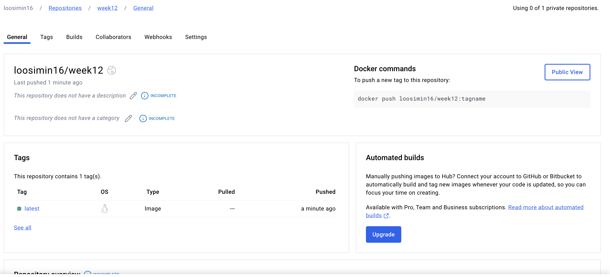

# SiMinL_MiniProj12

# Requirements
Create a simple python application containerized with a dockerfile. The goal here is to both demonstrate running your application within a docker container (using docker run terminal commands) but to also build a docker image in your CI/CD pipeline which will be pushed to Docker Hub or other container management service.

1. Create an account in Dockerhub
2. Create a token
3. Get the username and password
4. Configure in Github

